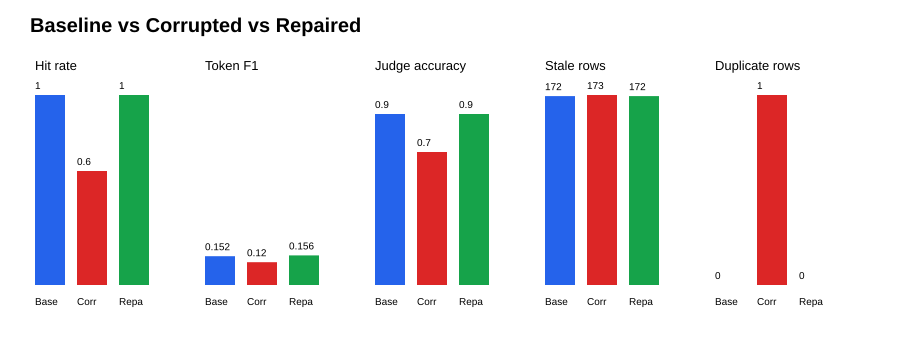

# Corruption Comparison Report

| State | Samples | Retrieval hit rate | Mean token F1 | Judge accuracy |
| --- | ---: | ---: | ---: | ---: |
| Baseline | 42 | 0.1429 | 0.0537 | 0.4048 |
| Corrupted | 42 | 0.1429 | 0.0589 | 0.4524 |
| Repaired | 42 | 0.1429 | 0.0604 | 0.4286 |

## Data quality and freshness

| State | Valid | Rows | Duplicate rows | Stale rows | Missing dates |
| --- | --- | ---: | ---: | ---: | ---: |
| Baseline | True | 197 | 0 | 172 | 6 |
| Corrupted | False | 198 | 1 | 173 | 6 |
| Repaired | True | 197 | 0 | 172 | 6 |

Frozen test-set SHA-256: `db85afe199ac6a51bbb5abd0ce4c1cbdcc542bf39cebafbc660e67ffe29cc377`

